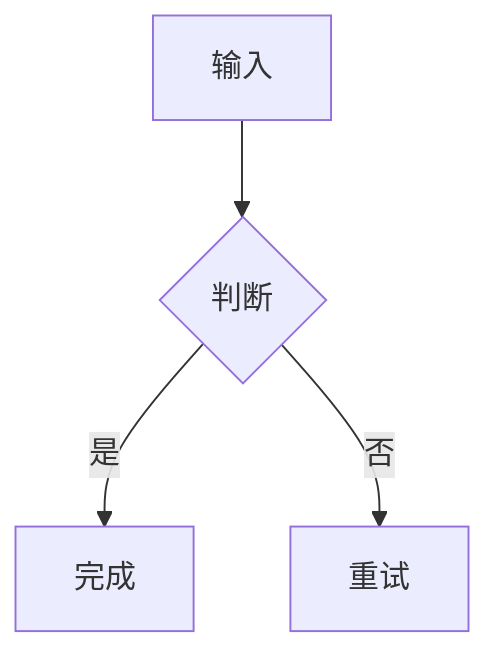

# Markdown 完整样例

此文件用于在聊天、文件预览和记忆页面手工检查 Markdown。链接与图片需要联网才可加载；图片失败时应保留 alt。

## CommonMark 与 GFM

# 一级标题
## 二级标题
### 三级标题
#### 四级标题
##### 五级标题
###### 六级标题

段落包含 **粗体**、*斜体*、***粗斜体***、~~删除线~~、`inline code`、\*转义星号\*、[链接](https://example.com)、[引用链接][reference] 与自动链接 https://example.com、www.example.com、mail@example.com。

[reference]: https://example.com "引用链接"

第一行以两个空格结尾，  
这里应硬换行。下一行则是普通软换行。

---

> 引用中的 **重点** 和 [链接](https://example.com)
>
> 第二段引用；卡片底部应该有留白。
>
> - 引用中的列表

1. 有序列表
2. 第二项
    - 嵌套无序项
    - [x] 已完成任务
    - [ ] 未完成任务
3. 最后一项

| 左对齐 | 居中 | 右对齐 |
| :--- | :---: | ---: |
| **加粗** | a\|b | 42 |

```kotlin
val literal = "[^1] ==highlight== $x$ <details>"
```

    缩进代码：[参考^1] 不应解析。

## 扩展内联语法

==高亮==、H~2~O、x^2^、行内公式 $E=mc^2$ 和 \(a+b\)。货币 $10 和 $20 应保留文本。

安全行内标签：<sup>上标</sup>、<sub>下标</sub>、<mark>标记</mark>、<kbd>Ctrl</kbd>。<br>此处换行。

定义脚注[^1]、带文字的兼容脚注[参考^1]；未知脚注[^missing] 原样显示。转义的 \[^1] 应保留文本，`[^1]` 应保留代码。


[^1]: 脚注正文支持 **Markdown** 和 [链接](https://example.com)，点击引用应弹出原生可读内容。

## 详情与脚注共存

<details open><summary>展开说明 **重点**[^1]</summary>

详情内再次引用[^1]，也支持表格：

| A | B |
| --- | --- |
| 1 | 2 |

</details>

<details><summary>默认折叠</summary>

内容可以点击展开。

</details>

## 数学公式与 Mermaid

$$
E = mc^2
$$

\[
\int_0^1 x^2 \, dx = \frac{1}{3}
\]

```math
\frac{a}{b}
```



## 边界

原始 HTML 中仅识别安全的 `details/summary`、`sup/sub/mark/kbd` 和 `br`；其余标签不执行。图片只加载 HTTP/HTTPS 地址；相对路径、`file:`、`content:` 与加载失败均显示 alt。脚注只识别已定义的 `[^id]` 或 `[文字^id]`，未引用的定义显示在文末。公式与 Mermaid 使用内置离线渲染组件；无论渲染成败，源码仍应能查看、复制。
